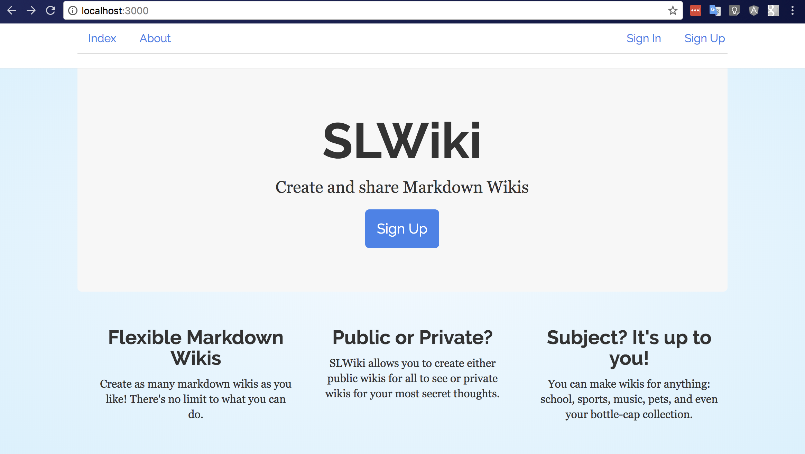

# SLWiki
#### Create public and private markdown wikis.

## System dependencies
* [Devise](https://github.com/plataformatec/devise) is used for user authentication.
* [Stripe](https://github.com/stripe/stripe-ruby) integration allows users to update to premium accounts.
* [Pundit](https://github.com/elabs/pundit) creates policies to control access to private wikis.
* [Redcarpet](https://github.com/vmg/redcarpet) facilitates markdown processing.

## Getting Started

This application was built using `rails 4.2.8`.

### Installing

In order to install **SLWiki** locally:

1. Clone or download this repo.
2. Run `bundle install` to install dependencies
3. Run `rake db:create`, `rake  db:migrate`, and `rake db:seed` to setup the database
4. Run `rails s` and navigate to `localhost:3000` to use in your browser.

### Testing

Tests for the controllers and models are easy to run to ensure all is working.

Simply run `rspec spec/controllers` to run all the tests for controllers. Individual tests can be run with `rspec spec/folder_name/file_name.rb`.

## Authors

**Scott Lenander** - [SJl149](https://github.com/SJl149)

## Acknowledgements

Special thanks to my mentor, Charlie Gaines [beaugaines](https://github.com/beaugaines), and [Bloc](http://bloc.io).
